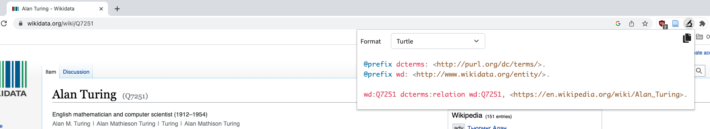
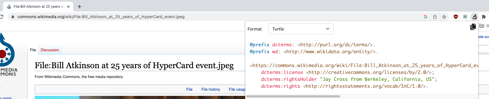

# Knowledge graph curator

Chrome web extension for curating RDF knowledge graph statements from sites like Wikidata and Wikimedia Commons.

## Installation

See "Development", below.

## Use

### With Wikidata

1. Navigate to a Wikidata concept page e.g., [Alan Turing](https://www.wikidata.org/wiki/Q7251).
2. Open the extension's popup by clicking on its icon (a microscope) in the extensions bar
3. The popup displays the detected RDF
4. Copy the detected RDF to your clipboard using the copy icon

### With Wikimedia Commons

1. Navigate to a Wikimedia Commons File page. For example:
   1. On [https://en.wikipedia.org/wiki/Bill_Atkinson](https://en.wikipedia.org/wiki/Bill_Atkinson), click on the [image](https://en.wikipedia.org/wiki/File:Bill_Atkinson_at_25_years_of_HyperCard_event.jpeg) in the info table.
   1. On the image page, click on the ["More details"](https://commons.wikimedia.org/wiki/File:Bill_Atkinson_at_25_years_of_HyperCard_event.jpeg) button
   1. You should now be on the Wikimedia Commons File page [https://commons.wikimedia.org/wiki/File:Bill_Atkinson_at_25_years_of_HyperCard_event.jpeg](https://commons.wikimedia.org/wiki/File:Bill_Atkinson_at_25_years_of_HyperCard_event.jpeg).
2. Open the extension's popup by clicking on its icon (a microscope) in the extensions bar
3. The popup displays the detected RDF
4. Copy the detected RDF to your clipboard using the copy icon

## Development

### Prerequisites

* yarn or npm
* Node 16+

### Installing dependencies

    yarn install

### Building the unpacked extension to `dist/`

    yarn build

### Installing the unpacked build into Chrome

1. Open the "Help" menu, then "Extensions".
1. Enable the "Developer mode" slider
1. Click the "Load unpacked" button
1. Select the `dist/` directory created by the build process, above.

### Debugging

    yarn start

watches for changes in the code and updates `dist/`. If you've installed the unpacked build (`dist/`) into Chrome, the browser will pick up the changes.

### Packing a .zip to publish on the Chrome Web Store

    yarn build
    yarn bundle

produces `dist/knowledge-graph-curator.zip`.
